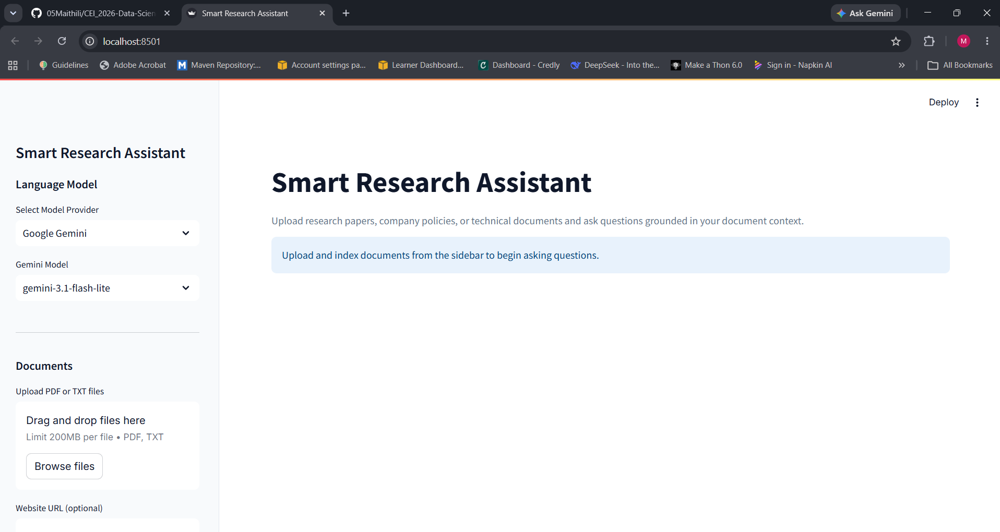
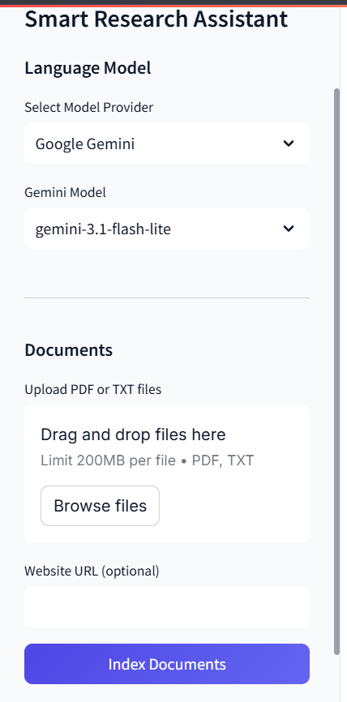
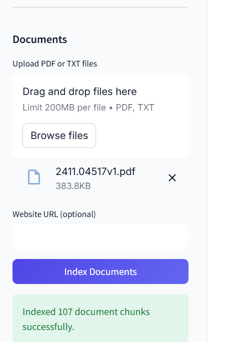
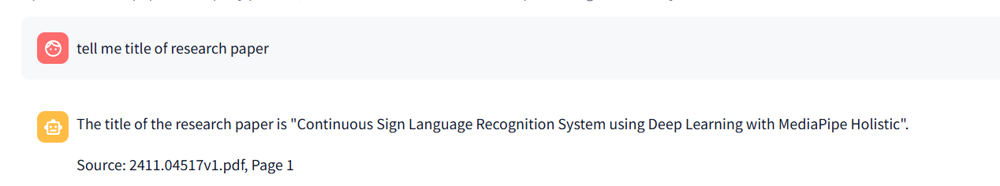
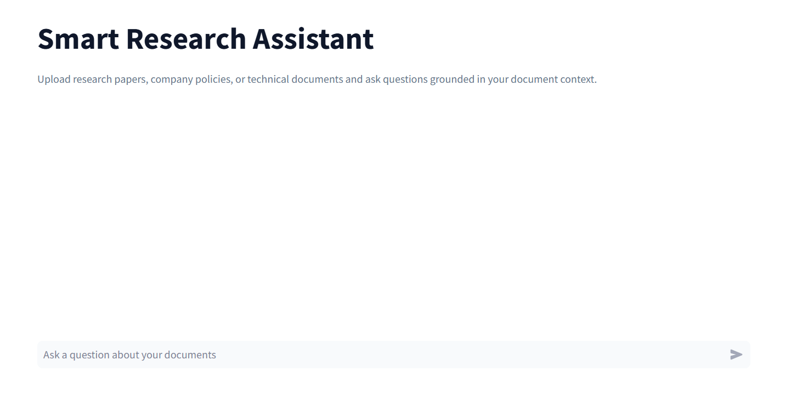
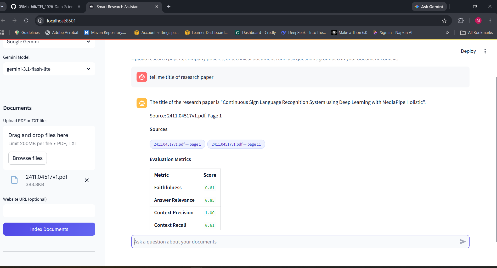
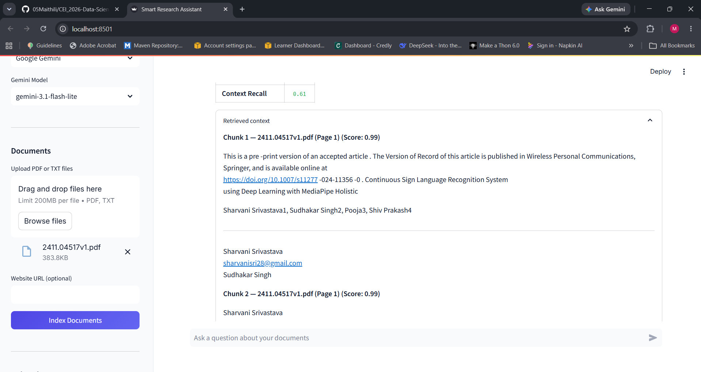

# Smart Research Assistant

## RAG-Based Knowledge System

Smart Research Assistant is a Retrieval-Augmented Generation (RAG) based application that allows users to upload research papers, company policies, technical documents, or web content and ask questions based on the provided information.

The system retrieves relevant information from the uploaded documents and generates grounded answers with source citations, retrieved context, and evaluation metrics.

---

## Features

* Upload **PDF and TXT documents**
* Load content from **Web URLs**
* Split documents into smaller chunks
* Generate embeddings using HuggingFace
* Store embeddings using **FAISS**
* Retrieve relevant information using **MMR**
* Generate answers using **Google Gemini or Ollama**
* Display source document and page number
* Display retrieved context and similarity scores
* Evaluate answers using four RAG metrics
* Gemini quota fallback to local Ollama model

---

## Technologies Used

| Technology            | Purpose                   |
| --------------------- | ------------------------- |
| Python                | Main programming language |
| Streamlit             | User interface            |
| LangChain             | RAG pipeline              |
| FAISS                 | Vector database           |
| HuggingFace           | Text embeddings           |
| Sentence Transformers | Embedding model           |
| Google Gemini         | Cloud LLM                 |
| Ollama                | Local LLM                 |
| RAGAS                 | RAG evaluation            |

### Embedding Model

```text
sentence-transformers/all-MiniLM-L6-v2
```

---

## Project Structure

```text
Smart Research-RAG/
│
├── app.py
├── .env
├── requirements.txt
├── README.md
│
├── screenshots/
│   ├── home.png
│   ├── document_upload.png
│   ├── question_answer.png
│   ├── evaluation_metrics.png
│   └── retrieved_context.png
│
├── .streamlit/
│   └── config.toml
│
└── src/
    ├── ingestion.py
    ├── vectorstore.py
    ├── qa_chain.py
    └── evaluation.py
```

### File Description

| File               | Description                                           |
| ------------------ | ----------------------------------------------------- |
| `app.py`           | Streamlit application and chat interface              |
| `ingestion.py`     | Loads PDF, TXT, and web documents                     |
| `vectorstore.py`   | Creates embeddings, FAISS vector store, and retriever |
| `qa_chain.py`      | Builds the RAG chain and generates answers            |
| `evaluation.py`    | Calculates RAG evaluation metrics                     |
| `requirements.txt` | Contains required Python packages                     |
| `.env`             | Stores the Google API key                             |
| `config.toml`      | Streamlit configuration                               |
| `screenshots/`     | Contains application output screenshots               |

---

## How the System Works

## 1. Document Ingestion

The system accepts:

* PDF files
* TXT files
* Web URLs

During ingestion, the system extracts the document content and preserves metadata such as the source name and page number.

---

## 2. Text Chunking

The extracted text is divided into smaller chunks using `RecursiveCharacterTextSplitter`.

```text
Chunk Size    = 500 characters
Chunk Overlap = 100 characters
```

The overlap helps maintain context between consecutive chunks.

---

## 3. Embeddings

Each document chunk is converted into a numerical vector using:

```text
sentence-transformers/all-MiniLM-L6-v2
```

These embeddings represent the semantic meaning of the document content.

---

## 4. FAISS Vector Database

The generated embeddings are stored in a FAISS vector database.

FAISS allows the system to efficiently search for document chunks that are semantically similar to the user's question.

---

## 5. MMR Retrieval

The system uses Maximal Marginal Relevance (MMR) to retrieve relevant and diverse document chunks.

```text
k = 3
fetch_k = 6
```

The retriever first considers six candidate chunks and selects the three most relevant chunks.

The retrieval system also includes additional logic for:

* Page 1 title and author questions
* Numerical and percentage-based questions
* Bibliography filtering

---

## 6. Answer Generation

The retrieved context is passed to the selected language model.

Supported providers:

```text
Google Gemini
Ollama
```

The system uses a grounded prompt so that answers are generated from the retrieved document context.

If Google Gemini reaches its API quota, the system can fall back to the local Ollama model.

---

## 7. Source Citations

Each answer displays the source document and page number used for generating the response.

Example:

```text
2411.04517v1.pdf — page 1
```

This helps users verify the answer against the original document.

---

## 8. Retrieved Context

The application provides an expandable **Retrieved Context** section.

It displays:

* Chunk number
* Source document
* Page number
* Similarity score
* Retrieved text

This allows users to understand which document content was used to generate the answer.

---

## 9. Evaluation Metrics

The application evaluates generated answers using four metrics:

| Metric            | Purpose                                                         |
| ----------------- | --------------------------------------------------------------- |
| Faithfulness      | Checks whether the answer is supported by the retrieved context |
| Answer Relevance  | Checks whether the answer directly addresses the question       |
| Context Precision | Measures the relevance of retrieved chunks                      |
| Context Recall    | Checks whether the required information was retrieved           |

The system first attempts to use **RAGAS** for evaluation. If RAGAS evaluation fails, the system uses the `quick_score` method.

---

# Output Screenshots

# Main Interface



# Document Upload and Indexing




# Question and Answer




# Evaluation Metrics



## Retrieved Context



---

# Setup and Installation

## Prerequisites

Python 3.10 or later is recommended.

Check the installed Python version:

```powershell
python --version
```

---

## Create Virtual Environment

Create a virtual environment:

```powershell
python -m venv venv
```

Activate the environment:

```powershell
.\venv\Scripts\activate
```

---

## Install Dependencies

Install all required packages:

```powershell
pip install -r requirements.txt
```

---

# Environment Variables

Create a `.env` file in the project root directory.

Add your Google API key:

```env
GOOGLE_API_KEY=YOUR_GOOGLE_API_KEY
```

---

# Run the Application

Start the Streamlit application:

```powershell
streamlit run app.py
```
---

# Example Questions

After uploading a research paper, users can ask questions such as:

```text
What is the title of the paper?
```

```text
What is the main objective of the research?
```

The system returns the answer along with the relevant source and page number.

---

# Example RAG Output

```text
Question:
What is the title of the paper?

Answer:
The title of the paper is "Continuous Sign Language Recognition
System using Deep Learning with MediaPipe Holistic".

Source:
2411.04517v1.pdf — page 1
```

Evaluation metrics are also displayed for each response.

---

# RAG Pipeline Summary

```text
Document
   ↓
Text Extraction
   ↓
Chunking
   ↓
Embeddings
   ↓
FAISS
   ↓
MMR Retrieval
   ↓
Relevant Context
   ↓
LLM
   ↓
Grounded Answer
   ↓
Sources + Evaluation
```

---

# Conclusion

Smart Research Assistant combines **document processing, semantic embeddings, vector search, retrieval, and large language models** to provide grounded answers from user-provided documents.

The system improves document-based question answering by providing:

* Relevant retrieved context
* Source and page citations
* Grounded answers
* RAG evaluation metrics
* Support for multiple LLM providers

It can be used for research papers, technical documentation, company policies, and other document-based knowledge retrieval tasks.
